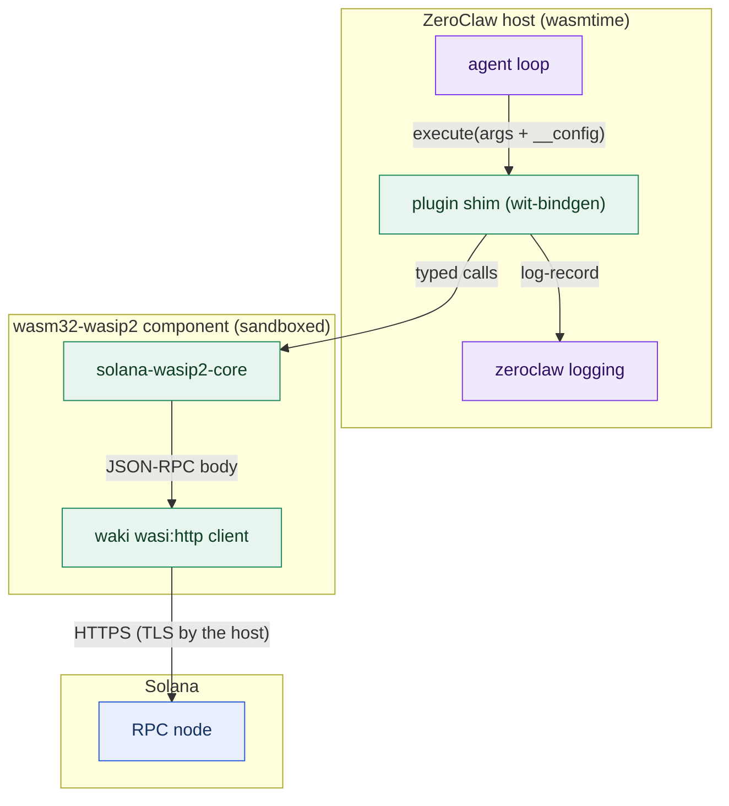

# solana-wasip2-core

Solana primitives for WebAssembly components targeting `wasm32-wasip2`,
where the standard Solana client stack does not link: no tokio, no reqwest,
no ring, no sockets, only the host's `wasi:http`. This crate is the substrate
the ZeroClaw Solana tool plugins in this repository build on, and it is
usable by any other `tool-plugin` component. 80 host tests, zero network in
tests, MIT. Every claim is reproducible with one command: `./prove.sh`
(see [EVIDENCE.md](EVIDENCE.md)).


-2b5fd9)


## What it does

- **JSON-RPC over a mockable trait.** `rpc::RpcClient` is generic over
  `http::JsonHttpTransport`; the wasm shim plugs in `WakiJsonTransport`
  (blocking `wasi:http`, TLS performed host-side), host tests plug in a mock.
  Implemented methods: `getLatestBlockhash`, `getAccountInfo` (jsonParsed,
  base64, and a zero-length dataSlice existence probe), and
  `getTokenLargestAccounts`.
- **Unsigned v0 transactions.** `txbuild` compiles instructions into a
  versioned (v0) message, zero-fills the signature slots, and returns the
  canonical base64 wallets and `simulateTransaction` accept. It hand-rolls
  `TransferChecked` (tag 12) so the same builder serves classic SPL Token
  and Token-2022, pinned byte-for-byte against `spl-token-interface` in a
  test.
- **Durable nonces.** `nonce` parses on-chain nonce state (rejecting legacy
  and uninitialized accounts) and `txbuild` prepends `AdvanceNonceAccount`
  as the first instruction, so an approval queue cannot outlive a ~90 second
  blockhash.
- **Solana Pay URLs.** `pay_url` builds spec-conformant
  `solana:` transfer request URLs with RFC 3986 percent-encoding, so free
  text can never inject URL parameters.
- **Money math without floats.** `amount` parses decimal strings into u64
  base units with checked integer arithmetic and formats them back
  canonically.
- **Mint risk facts.** `mint_inspect` parses jsonParsed mint data (classic
  and Token-2022 extensions: permanent delegate, transfer hook, transfer
  fee, frozen-by-default, and more) into typed facts and scores them
  red/amber/green with one reason per finding.
- **Injection-inert output.** `shape::sanitize_untrusted_text` bounds and
  flattens issuer-controlled text (token names, memos) before it reaches an
  LLM context window.
- **Honest settlement verification.** `payment_verify` computes a
  recipient's actual balance delta (SPL token or lamports) inside a
  transaction's metadata, because a transaction merely touching a payment
  reference is not a payment.
- **Config hygiene.** `config::find_unknown_config_keys` lets every plugin
  refuse a typoed config key instead of silently running with a guardrail
  off, and `token_map` provides the operator-controlled symbol map payment
  plugins share.

## How it works



Purple, host side; green, sandboxed component; blue, Solana. On failure
paths the crate returns typed `error::CoreError` values with distinct
variants (transport failure, HTTP status, JSON-RPC error object, malformed
shape, account not found, and so on); nothing in the library panics on
untrusted input, and callers surface the message that matches the failure.

## What compiles on wasm32-wasip2 (and what does not)

Verified in this repository on 2026-07-21, Rust 1.96.1. This table is the
short version of what fought us; the modular crates below are the escape
hatch from trap number two of the bounty brief.

| Works | Notes |
| --- | --- |
| solana-pubkey 4.2, solana-hash 4.5, solana-instruction 3.4, solana-message 4.4, solana-transaction 4.1, solana-nonce 3.2, solana-system-interface 3.2 | the modular SDK crates; serde + bincode 1.x yields canonical wire bytes |
| waki 0.5.1 | blocking wasi:http client; only a connect timeout exists |
| spl-token-interface 2, spl-associated-token-account-interface 2, spl-memo-interface 2.1 | lean, align with solana-pubkey v4 |
| getrandom 0.3 | WASI 0.2 random interface |

| Breaks or rejected | Why |
| --- | --- |
| solana-client, solana-rpc-client, solana-sdk (monolith) | tokio, mio, reqwest, socket2, ring: no wasip2 |
| spl-associated-token-account-client 2.0 | pins solana-pubkey v2: type-incompatible with the v4 stack |
| spl-token-2022-interface | drags the confidential-transfer proof stack for one program id |
| spl-token-interface transfer_checked for Token-2022 | validates the program id; this crate hand-rolls the instruction instead |

## Module surface

| Module | Key items | Job |
| --- | --- | --- |
| `error` | `CoreError` | one typed variant per failure mode |
| `http` | `JsonHttpTransport`, `WakiJsonTransport` | mockable blocking JSON POST |
| `rpc` | `RpcClient` | the four RPC methods above, shaped small |
| `addresses` | `parse_pubkey`, `derive_associated_token_address`, program ids | validated parsing, ATA derivation |
| `amount` | `parse_amount_to_base_units`, `format_base_units` | float-free money math |
| `txbuild` | `build_spl_transfer_transaction`, `build_unsigned_v0_transaction`, `TransactionLifetime` | unsigned v0 transactions, blockhash or durable nonce |
| `nonce` | `parse_nonce_account_data` | durable nonce state, legacy rejected |
| `pay_url` | `build_transfer_request_url` | Solana Pay transfer requests |
| `mint_inspect` | `parse_mint_facts`, `assess_mint_risk` | mint facts and red/amber/green scoring |
| `payment_verify` | `compute_recipient_token_delta`, `compute_recipient_lamport_delta` | settlement by balance delta, not reference touch |
| `token_map` | `built_in_symbol_map`, `extend_symbol_map_from_config` | operator-controlled token symbols |
| `config` | `find_unknown_config_keys` | fail-closed config sections |
| `shape` | `sanitize_untrusted_text` | injection-inert text for LLM output |

## Reproduce it

Prerequisites: Rust 1.96+ with the `wasm32-wasip2` target.

```bash
./prove.sh   # everything: 5 crates' tests, clippy both targets, 4 wasm
             # builds, and the cross-stack oracle vs @solana/web3.js
```

Or piecewise: `cargo test` (80 host tests, no network, no wasm toolchain)
and `cargo check --target wasm32-wasip2`. Test fixtures under
`tests/fixtures/` are real mainnet RPC responses captured on 2026-07-21
(USDC and PYUSD mints, a missing account, a real failed transaction, a
fee-splitting transfer, a live 429 from the public endpoint); tests never
touch the network. [EVIDENCE.md](EVIDENCE.md) maps every claim to its
command.

## What is real and what is not

- **No signing, by design.** The crate builds unsigned transactions only.
  There is no keypair type anywhere in the dependency tree; custody stays
  with the operator's wallet or the host's signing flow.
- **jsonParsed is trusted for mint parsing.** Extension facts come from the
  RPC node's parser. An operator who does not trust their RPC endpoint
  should run their own; the plugins built on this crate take the endpoint
  from operator config only.
- **Durable nonces carry an upstream caveat.** The official documentation
  notes durable nonces may be deprecated in a future release
  ([docs](https://solana.com/docs/core/transactions/durable-nonces));
  the recent-blockhash path works without them.
- **No priority fees yet.** Built transactions carry no compute budget
  instructions; congested-slot landing is the next milestone.
- **Not audited.** Reviewed and tested, but no third-party security audit.

## License

MIT. See [LICENSE](LICENSE).
